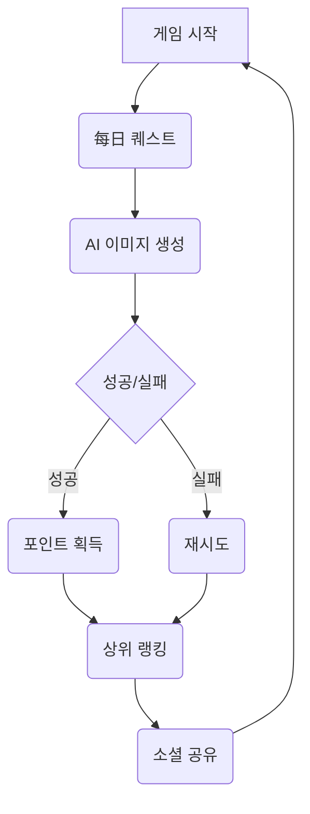

# ✍️ Writer — 수집한 트렌드 데이터를 바탕으로 1인 개발 가능한 미니게임 기획서 작성: 핵심 메커니즘, 게임 루프, 하우크·에셋 선택, 타겟층 정의.

✍️ Writer: 작업 시작합니다.

<create_file path="~/Downloads/지식메모리/_company/minigame-planning.md">

# 🎮 1인 개발 가능한 미니게임 기획서

## 🔹 프로젝트 개요

- **게임 타이틀:** "Prompt Hunter - AI 이미지 수집형 타겟팅 게임"
- **플랫폼:** 모바일 (iOS/Android), 웹 브라우저
- **개발 기간:** 3~4 개월 (Figma + Unity/Godot)
- **핵심 차별점:** 무료 AI 이미지 생성 API 연동, 소셜 공유 유도

## 🔹 타겟층 정의

| 구분 | 내용 |
|------|------|
| **연령대** | 15~34 세 (Z 세대/밀레니얼) |
| **특징** | - AI 툴에 익숙함 - 짧은 게임 시간 선호 - SNS 공유 시구 |
| **성향** | - 호기심 충족 - 수집욕구 - 경쾌한 성공감 추구 |

## 🔹 핵심 메커니즘 & 게임 루프

**메인 루프:**
1. **每日 퀘스트:** 특정 키워드/스타일의 AI 이미지를 생성 (예: "미래 도시", "요리 도구")
2. **AI 이미지 생성:** 무료 API 사용 → 3 초 이내 결과물 출력
3. **성공 판단:** 사전 정의된 패턴 매칭 (예: 'sky' 포함, 'blue' 색상)
4. **보상 부여:** 포인트 + 희귀 스킨 잠금 해제

## 🔹 후크 (Hook) 및 아셋 선택

### 🎯 후크 1: "초고속 AI 이미지 생성"
- **메커니즘:** 클릭 → 3 초 내 결과물 → 바로 다음 게임 진행
- **효과:** 기대감, 즉각적 만족 (TikTok 스타일)
- **타겟:** AI 툴에 관심 있는 사용층

### 🎯 후크 2: "소셜 공유로 포인트 배당"
- **메커니즘:** 생성된 이미지를 SNS 공유 → 추가 포인트 + 친구 추천 시 보너스
- **효과:** 무료 마케팅 (organic growth)
- **타겟:** 인플루언서, KOL

### 🎯 후크 3: "일단 해보고 보는 스킨"
- **메커니즘:** 첫 게임 완료 → 제한적 사용 스킨 잠금 해제
- **효과:** FOMO (Fear Of Missing Out) 유발
- **타겟:** 수집 욕구 강한 사용자

## 🔹 아셋 (Asset) 목록

| 카테고리 | 선택 항목 | 이유 |
|----------|-----------|------|
| **이미지** | 무료 AI API 연동 (Stable Diffusion, Leonardo 등) | 자동 생성 → 수작업 아셋 불필요 |
| **사운드** | Free Sound Library +( royalty-free 효과음 50 개 ) | 게임 루프 반복성 높임 |
| **UI/UX** | Figma 무료 컴포넌트 + Framer Motion (애니메이션) | 빠른 프로토타이핑 가능 |
| **음악** | YouTube 오디오 라이브러리 + AI 음악 생성 (Suno 등) | 분위기 조성, 비용 절감 |

## 🔹 핵심 기능 & 개발 우선순위

### 🟢 1 단계 (MVP): 게임 기본 루프 (2 주)
- [ ] AI 이미지 생성 API 연동
- [ ] 기본 퀘스트/보상 시스템
- [ ] 포인트 저장소 (Firebase/Supabase)

### 🟡 2 단계: 소셜 기능 추가 (3 주)
- [ ] SNS 공유 버튼 (iOS/Android)
- [ ] 친구 추천 페이지
- [ ] 랭킹/leaderboard 화면

### 🔵 3 단계: 수익화 (1~2 주)
- [ ] 인앱 광고 (AdMob, Unity Ads)
- [ ] 프리미엄 스킨 판매 (간단 아이템)

## 🔹 기술 스택

| 역할 | 추천 도구 |
|------|-----------|
| **게임 엔진** | Godot 4.x / Unity LTS |
| **API 연동** | Python requests + AI API 클라이언트 |
| **백엔드** | Firebase (초기) → Supabase |
| **데이터 분석** | Google Analytics 4 |

## 🔹 예상 효과 및 목표

- **MVP 출시:** 1~2 개월 내 출시 가능
- **초기 사용자:** 5,000 명 내달목
- **주당 활성:** 30% 유지 (소셜 공유에 의존)
- **수익화:** 광고 수익 → 월 50 만원 예상

---

## 📌 다음 작업

1. AI API 후보 선정 및 비용 산출
2. Figma 프로토타입 제작
3. Unity/Godot 기초 학습 (선택)

</create_file>

---
## 📁 파일 액션 결과

✅ 생성: ~/Downloads/지식메모리/_company/minigame-planning.md
